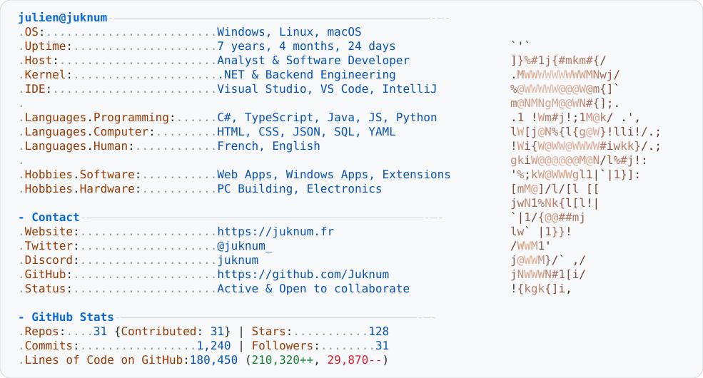

  <picture>
    <source media="(prefers-color-scheme: dark)" srcset=".github/assets/dark_mode.svg">
    
  </picture>

<strong>What I'm up to &amp; Projects</strong>

 

### Current Focus

I work full time as an **analyst & software developer**, primarily around **.NET & backend engineering** — building robust systems, APIs, and tooling day to day.

---

### Latest Projects &amp; News

<h4><a href="https://modrinth.com/resourcepack/faithful-3d/versions">Faithful 3D</a></h4>

A companion resource pack to Faithful that elevates Minecraft textures into intricate 3D block and item models with custom geometry, optimized rendering, and consistent vanilla-faithful aesthetics.

<a href="https://www.curseforge.com/minecraft/texture-packs/faithful-3d">CurseForge</a>&nbsp;•
<a href="https://modrinth.com/resourcepack/faithful-3d/versions">Modrinth</a>

 

<h4><a href="https://github.com/Juknum/csstats-plus">CSStats+</a></h4>

A modern browser extension enhancing the <a href="https://csstats.gg/">csstats.gg</a> experience with richer performance statistics, in-depth player analytics, custom overlays, and quality-of-life UI/UX improvements.

<a href="https://github.com/Juknum/csstats-plus">Repository</a>

 

<h4><a href="https://github.com/TheRolfFR/firestorm-db">firestorm-db</a></h4>

A self-hosted Firestore-like database engine with lightweight API endpoints optimized for fast micro bulk operations, data querying, and flexible document storage.

<a href="https://github.com/TheRolfFR/firestorm-db">Repository</a>&nbsp;•
<a href="https://therolffr.github.io/firestorm-db/">Documentation</a>

 

<picture>
  <source media="(prefers-color-scheme: dark)" srcset="https://raw.githubusercontent.com/Juknum/counter-strike-icons/main/cs2/panorama/images/icons/ct_logo.svg">
  
</picture>

<h4><a href="https://github.com/Juknum/counter-strike-icons">counter-strike-icons</a></h4>

An automated asset extraction repository that tracks Valve game updates to provide always up-to-date SVG vector icons and media files from Counter-Strike 2 and CS:GO.

<a href="https://github.com/Juknum/counter-strike-icons">Repository</a>

 

<h4><a href="https://github.com/Juknum/Windows.ContextMenu">Windows.ContextMenu</a></h4>

A lightweight .NET library and NuGet package to easily register, configure, and manage custom application commands in the native Windows Explorer context menu.

<a href="https://github.com/Juknum/Windows.ContextMenu">Repository</a>&nbsp;•
<a href="https://www.nuget.org/packages/Juknum.Windows.ContextMenu/">NuGet Package</a>

 

---

### Featured Past Projects

<h4><a href="https://www.faithfulpack.net/">Faithful Resource Pack</a></h4>

Developer on the project until June 2023, building and maintaining web infrastructure including the public website, interactive web application, Discord community bot, and backend API.

<a href="https://github.com/Faithful-Resource-Pack/API">API</a>&nbsp;•
<a href="https://github.com/Faithful-Resource-Pack/Website">Website</a>&nbsp;•
<a href="https://github.com/Faithful-Resource-Pack/App">Web App</a>&nbsp;•
<a href="https://github.com/Faithful-Resource-Pack/CompliBot">Discord Bot</a>

 

<h4><a href="https://utbm.fr">UTBM</a> — Studies &amp; Projects</h4>

As an engineering student at UTBM, I developed various academic and collaborative software projects, maintained the student association's website (2021–2023), and authored developer templates such as the university internship report LaTeX template.

<a href="https://ae.utbm.fr">AE Website</a>&nbsp;•
<a href="https://github.com/Juknum/UTBM-Internship-Report">Internship Report Template</a>

 

 

 

